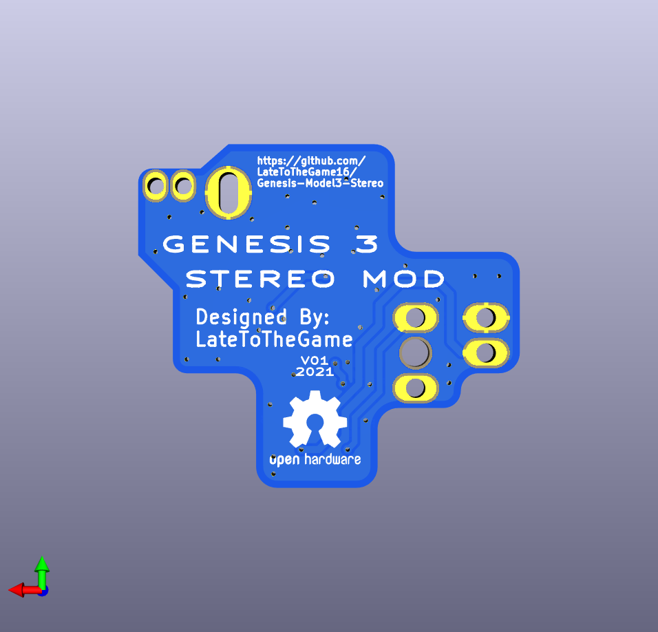

# Sega Genesis Model 3 Stereo Mod
Restore stereo audio on a Sega Model 3. Only three wires to solder. Composite video still works! Only usable on a Model 3 Genesis.
This is a redesign of the fantastic 3bp from dbElectronics and Tian Feng. The goal of this project was to minimize wires to only do the audio bypass.
 

# Installation Instructions
Currently I suggest using the Audio installation instructions from https://github.com/zaxour/TripleBypassV2Plus
The 32X audio is taken from the cart connector. The audio is output to the Genesis Mini-DIN.
Solder wires for Audio Left, Audio Right, PSG taken from the top side of the Genesis motherboard.
# Design Files
The designs are done with Kicad 6.0. The designs were done from scratch and are native to Kicad. 
The schematic uses the same values as https://github.com/tianfeng33/triple-bypass-Version-2. 
The mechanicals changed to ease installation. 
# Change Log from V2
  - Schematics and Layout redrawn from scratch in Kicad. 
  - Only three wires need to be soldered. Video signals are not touched.
